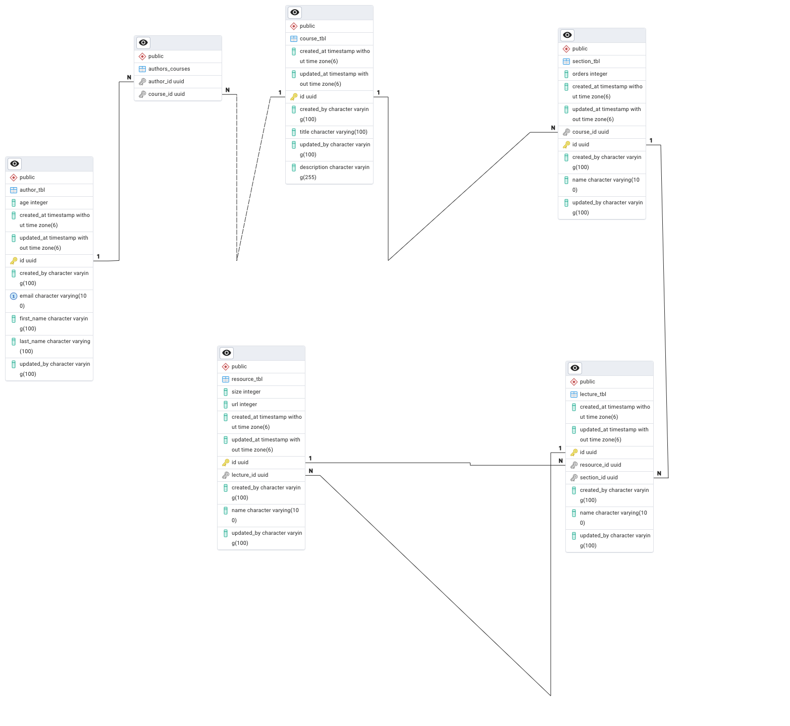

## E-Learning Platform Database Schema
This repository contains the database schema for an e-learning platform. The platform allows authors to create courses, and each course is divided into multiple sections, which contain lectures and additional resources. This schema is implemented using Spring JPA to facilitate ease of development with a powerful ORM layer.

### Database Diagram
Below is a conceptual representation of the database schema:

### Entities Overview:
1. Author
2. Course
3. Section
4. Lecture
5. Resource

### ER Diagram

The diagram shows how different entities of the e-learning platform relate to one another.


### Database Schema
#### Entity Descriptions:
1. Author

   - Represents an individual who creates and manages courses on the platform.
   - Fields:
     - id: Primary key (UUID)
     - firstName: Author's full name (String)
     - lastName: Author's full name (String)
     - age: Author age (Integer)
     - email: Contact email (String)
     - createdAt: created when (Date)
     - updatedAt: update when (Date)
     - createdBy: created by whom (String)
     - updatedBy: updated by whom (String)
     
2. Course

   - Represents a course authored by an Author.
   - Fields:
     - id: Primary key (UUID)
     - title: Course title (String)
     - description: A description of the course (String)
     - authorId: Foreign key referencing Author
     - sectionId: Foreign key referencing Sections
     - publishedDate: Date when the course was published (Date)
     - createdAt: created when (Date)
     - updatedAt: update when (Date)
     - createdBy: created by whom (String)
     - updatedBy: updated by whom (String)
     
3. Section

   - Represents a logical section in a course, which groups related lectures.
   - Fields:
     - id: Primary key (UUID)
     - courseId: Foreign key referencing Course
     - lectureId: Foreign key referencing Lecture
     - name: Section title (String)
     - orders: Section order within the course (Integer)
     - createdAt: created when (Date)
     - updatedAt: update when (Date)
     - createdBy: created by whom (String)
     - updatedBy: updated by whom (String)

4. Lecture

   - Represents a lecture within a section of a course.
   - Fields:
     - id: Primary key (UUID)
     - sectionId: Foreign key referencing Section
     - resourceId: Foreign key referencing Resource
     - name: Lecture title (String)
     - duration: Duration of the lecture in minutes (Integer)
     - createdAt: created when (Date)
     - updatedAt: update when (Date)
     - createdBy: created by whom (String)
     - updatedBy: updated by whom (String)
     
5. Resource

   - Represents an additional resource associated with a lecture (e.g., downloadable PDFs, links).
   - Fields:
     - id: Primary key (UUID)
     - lectureId: Foreign key referencing Lecture
     - name: Resource title (String)
     - type: Type of resource (e.g., PDF, Link) (String)
     - url: URL to access the resource (String)
     - createdAt: created when (Date)
     - updatedAt: update when (Date)
     - createdBy: created by whom (String)
     - updatedBy: updated by whom (String)
     
6. Relationships:
   - **Author ↔ Course:** Many-to-Many (An author can create multiple courses, Course can be created by multiple Authors)
   - **Course ↔ Section:** One-to-Many (A course can have multiple sections)
   - **Section ↔ Lecture:** One-to-Many (A section can contain multiple lectures)
   - **Lecture ↔ Resource:** One-to-Many (A lecture can have multiple resources)
   
7. Technologies Used
   - Java with Spring Boot and Spring Data JPA.
   - MySQL/PostgreSQL: The database schema can be implemented in any relational database.
   - Hibernate ORM for managing entity relationships.

8. ### Database Schema in sql (Data Definition Language)
```
BEGIN;


CREATE TABLE IF NOT EXISTS public.author_tbl
(
age integer NOT NULL,
created_at timestamp(6) without time zone NOT NULL,
updated_at timestamp(6) without time zone NOT NULL,
id uuid NOT NULL,
created_by character varying(100) COLLATE pg_catalog."default" NOT NULL,
email character varying(100) COLLATE pg_catalog."default" NOT NULL,
first_name character varying(100) COLLATE pg_catalog."default" NOT NULL,
last_name character varying(100) COLLATE pg_catalog."default" NOT NULL,
updated_by character varying(100) COLLATE pg_catalog."default" NOT NULL,
CONSTRAINT author_tbl_pkey PRIMARY KEY (id),
CONSTRAINT author_tbl_email_key UNIQUE (email)
);

CREATE TABLE IF NOT EXISTS public.authors_courses
(
author_id uuid NOT NULL,
course_id uuid NOT NULL
);

CREATE TABLE IF NOT EXISTS public.course_tbl
(
created_at timestamp(6) without time zone NOT NULL,
published_date timestamp(6) without time zone NOT NULL,
updated_at timestamp(6) without time zone NOT NULL,
id uuid NOT NULL,
created_by character varying(100) COLLATE pg_catalog."default" NOT NULL,
title character varying(100) COLLATE pg_catalog."default" NOT NULL,
updated_by character varying(100) COLLATE pg_catalog."default" NOT NULL,
description character varying(255) COLLATE pg_catalog."default" NOT NULL,
CONSTRAINT course_tbl_pkey PRIMARY KEY (id)
);

CREATE TABLE IF NOT EXISTS public.lecture_tbl
(
duration integer NOT NULL,
created_at timestamp(6) without time zone NOT NULL,
updated_at timestamp(6) without time zone NOT NULL,
id uuid NOT NULL,
resource_id uuid,
section_id uuid,
created_by character varying(100) COLLATE pg_catalog."default" NOT NULL,
name character varying(100) COLLATE pg_catalog."default" NOT NULL,
updated_by character varying(100) COLLATE pg_catalog."default" NOT NULL,
CONSTRAINT lecture_tbl_pkey PRIMARY KEY (id),
CONSTRAINT lecture_tbl_resource_id_key UNIQUE (resource_id)
);

CREATE TABLE IF NOT EXISTS public.resource_tbl
(
size integer NOT NULL,
url integer NOT NULL,
created_at timestamp(6) without time zone NOT NULL,
updated_at timestamp(6) without time zone NOT NULL,
id uuid NOT NULL,
lecture_id uuid,
created_by character varying(100) COLLATE pg_catalog."default" NOT NULL,
name character varying(100) COLLATE pg_catalog."default" NOT NULL,
updated_by character varying(100) COLLATE pg_catalog."default" NOT NULL,
CONSTRAINT resource_tbl_pkey PRIMARY KEY (id),
CONSTRAINT resource_tbl_lecture_id_key UNIQUE (lecture_id)
);

CREATE TABLE IF NOT EXISTS public.section_tbl
(
orders integer NOT NULL,
created_at timestamp(6) without time zone NOT NULL,
updated_at timestamp(6) without time zone NOT NULL,
course_id uuid,
id uuid NOT NULL,
created_by character varying(100) COLLATE pg_catalog."default" NOT NULL,
name character varying(100) COLLATE pg_catalog."default" NOT NULL,
updated_by character varying(100) COLLATE pg_catalog."default" NOT NULL,
CONSTRAINT section_tbl_pkey PRIMARY KEY (id)
);

ALTER TABLE IF EXISTS public.authors_courses
ADD CONSTRAINT fk18x5tfp70n54kkc34wobxmlfy FOREIGN KEY (author_id)
REFERENCES public.author_tbl (id) MATCH SIMPLE
ON UPDATE NO ACTION
ON DELETE NO ACTION;


ALTER TABLE IF EXISTS public.authors_courses
ADD CONSTRAINT fkip6yl5x0so9xi0kfr8m41s5ny FOREIGN KEY (course_id)
REFERENCES public.course_tbl (id) MATCH SIMPLE
ON UPDATE NO ACTION
ON DELETE NO ACTION;


ALTER TABLE IF EXISTS public.lecture_tbl
ADD CONSTRAINT fk2tj6jtiq0v5f5fsxsuv8y7ekx FOREIGN KEY (section_id)
REFERENCES public.section_tbl (id) MATCH SIMPLE
ON UPDATE NO ACTION
ON DELETE NO ACTION;


ALTER TABLE IF EXISTS public.lecture_tbl
ADD CONSTRAINT fkbn6hxnojy3ju1ygbi2kkrhco1 FOREIGN KEY (resource_id)
REFERENCES public.resource_tbl (id) MATCH SIMPLE
ON UPDATE NO ACTION
ON DELETE NO ACTION;
CREATE INDEX IF NOT EXISTS lecture_tbl_resource_id_key
ON public.lecture_tbl(resource_id);


ALTER TABLE IF EXISTS public.resource_tbl
ADD CONSTRAINT fkh53qal2m76xwtajpvnl3drapm FOREIGN KEY (lecture_id)
REFERENCES public.lecture_tbl (id) MATCH SIMPLE
ON UPDATE NO ACTION
ON DELETE NO ACTION;
CREATE INDEX IF NOT EXISTS resource_tbl_lecture_id_key
ON public.resource_tbl(lecture_id);


ALTER TABLE IF EXISTS public.section_tbl
ADD CONSTRAINT fk69n339slrf3afq23jjfcranyq FOREIGN KEY (course_id)
REFERENCES public.course_tbl (id) MATCH SIMPLE
ON UPDATE NO ACTION
ON DELETE NO ACTION;

END;
```
#
